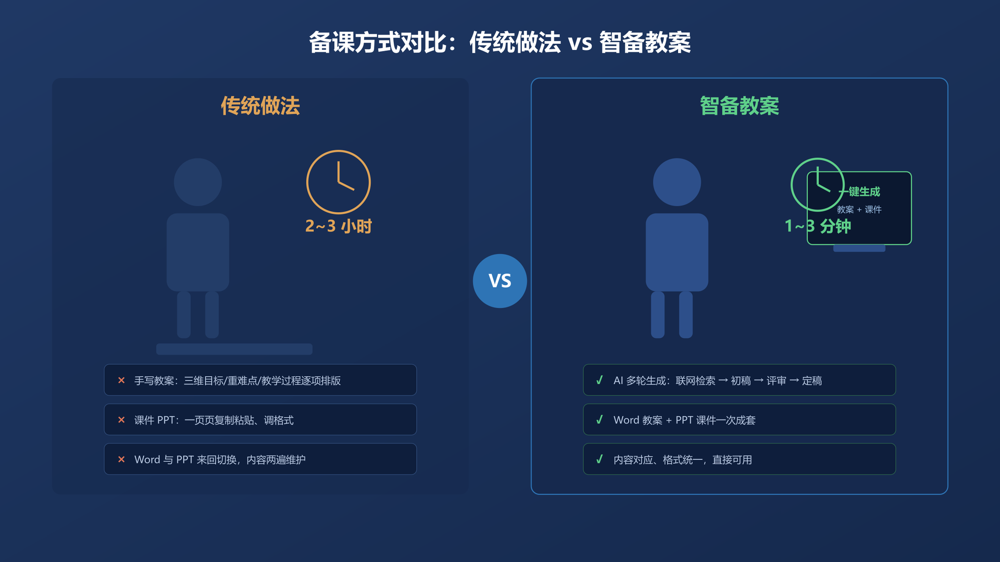
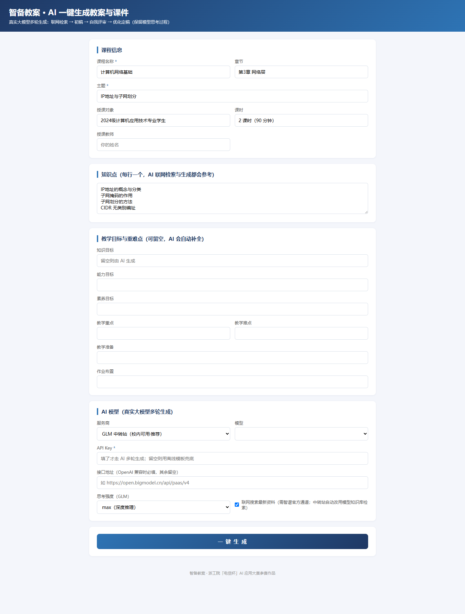
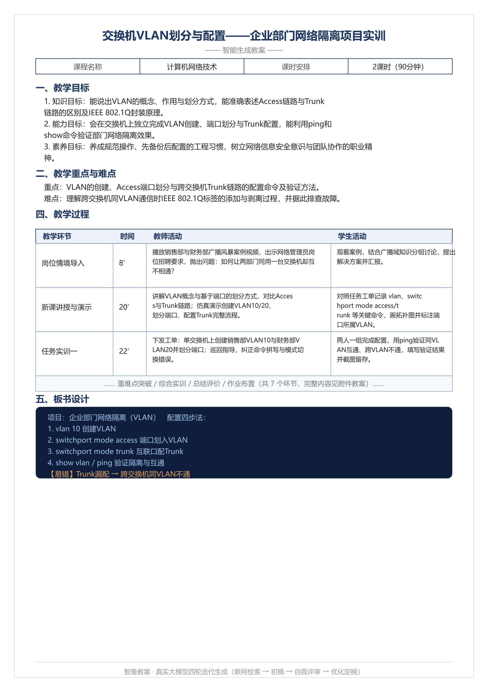
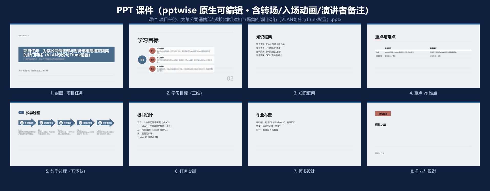
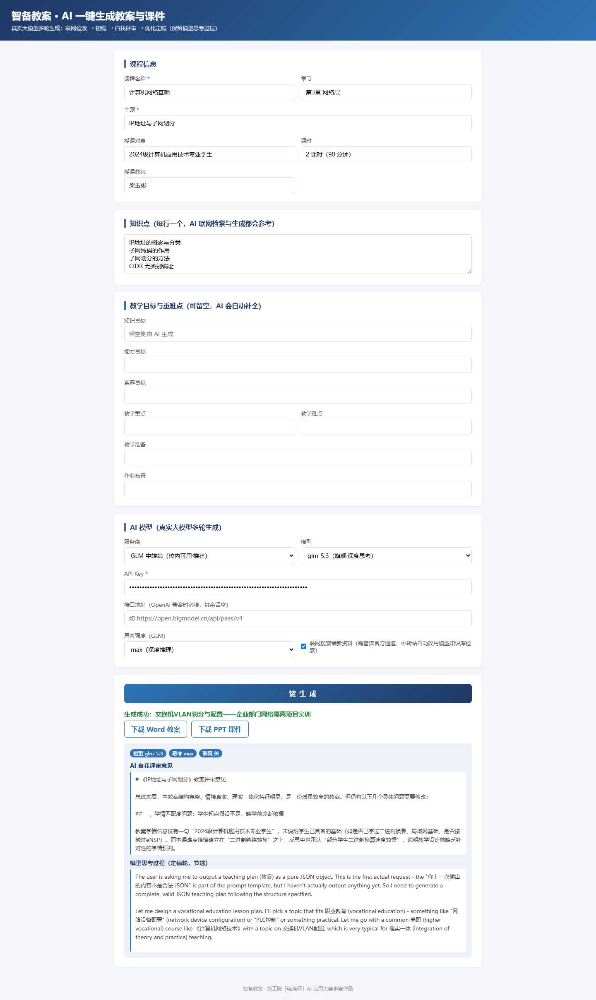
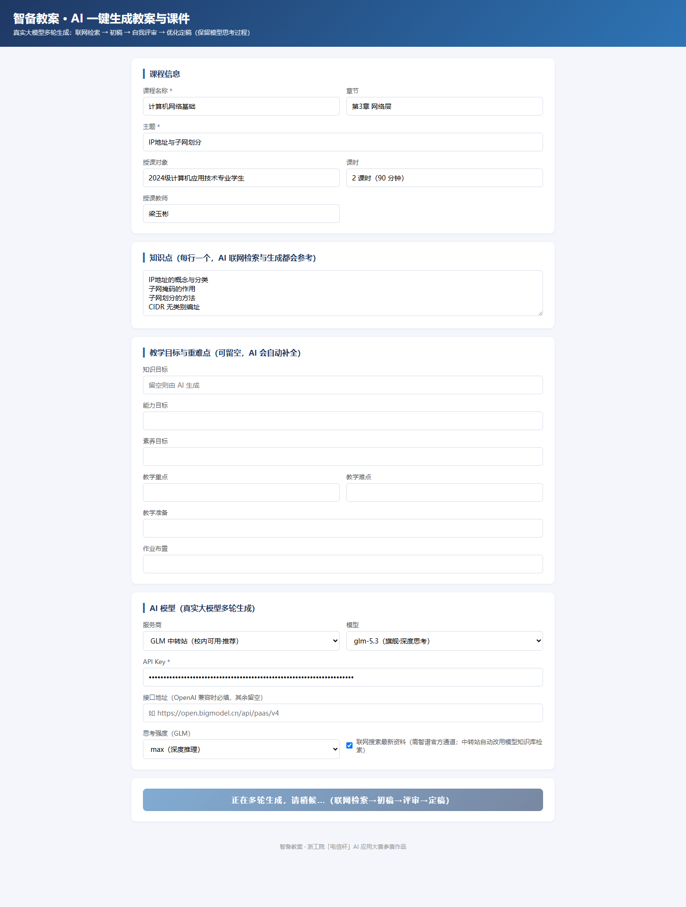
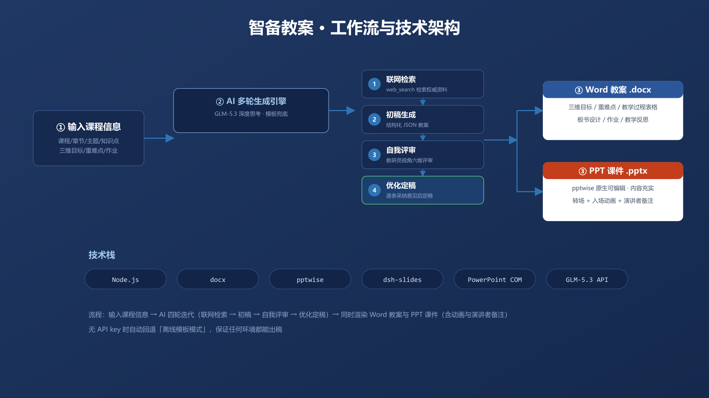
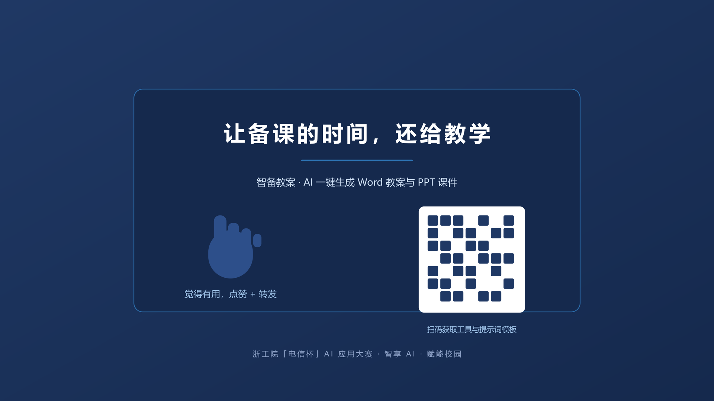

# 智备教案：AI 一键生成 Word 教案与 PPT 课件

> 参赛作品｜主题：智享AI·赋能校园｜形式：图文经验帖
> 工具：智备教案（自建 AI 应用）｜标签：AI教学设计、教案生成、PPT课件、GLM-5.3、多轮生成、效率提升

## 一、痛点：备课的两大负担

老师备课最耗时的两件事：写教案、做课件。

一份规范教案要包含三维目标、重难点、教学过程（导入/新课/巩固/小结/作业）、板书、作业、反思，逐环节列成表格；写完还得再做配套 PPT。更常见的是——**教案写得挺充分，课件却只能把教案压缩成几个干巴巴的要点**，内容又短又空，上台根本撑不起一节课。

这就是「智备教案」要解决的：让 AI 联网查资料、多轮打磨，**一键产出「内容充实」的 Word 教案 + 原生可编辑的 PPT 课件**。

## 二、作品是什么：真实大模型多轮生成，一键出两份成品

「智备教案」是一个网页小工具：输入课程信息，它调用**真实大模型**走完「联网检索 → 初稿 → 自我评审 → 优化定稿」四轮迭代，一次性输出 Word 教案 + PPT 课件。

以《计算机网络基础 · IP地址与子网划分》为例：

**Word 教案（.docx）**：标题、基本信息表、三维教学目标、重难点、教学准备、教学过程表格、板书、作业、反思，排版整齐可直接打印。

**PPT 课件（.pptx）**：用 pptwise 引擎渲染，**原生可编辑的 PPTX**（不是图片、不是 HTML），每页用真实教案内容填满——学习目标、知识变化、重点难点对比、五环节教学过程、板书设计、作业，而不是固定的占位文案。

更进一步的，课件还带**转场动画、逐元素入场动画和演讲者备注**：程序通过 PowerPoint COM 自动化给每页加转场、给每个元素编排入场动画（首个单击、其余自动接续），并把教学过程的「教师活动/设计意图」自动写进演讲者备注——上台放映时就是一份有节奏感的成品课件，不用再手动加动画。

还内置第二套 **dsh-slides 引擎**：一键同时产出 **HTML 自包含演示**（单文件、零依赖、浏览器打开即放映，按 S 看演讲备注、Ctrl+P 直接打印 PDF）和可编辑 PPTX，5 套成套主题可换——教室电脑没装 Office 也能放映。

## 三、分步操作：三步出稿

**Step 1 填字段**：课程、章节、主题、授课对象、课时、知识点、三维目标、重难点、作业。

**Step 2 配模型**：选服务商（智谱 GLM-5.3 / DeepSeek / OpenAI 兼容）、填 API Key、调思考强度（low/high/max）、开联网搜索。

**Step 3 点生成**：走完四轮迭代后下载 .docx + .pptx，网页同时展示「联网参考来源」「自我评审意见」「模型思考过程」。

## 四、创新点（对应大赛「实用性 / 创新性 / 完整性 / 推广性」）

**1. 真·多轮 AI，不是套模板。** 联网检索 → 初稿 → 自我评审 → 优化定稿四轮迭代，支持 GLM-5.3 深度思考模式（保留 reasoning_content 思维链）、联网搜索标注参考来源，多模型可切换。

**2. PPT 真正「内容充实 + 有动画」。** 课件不再把教案压缩成占位要点，而是用 pptwise 引擎把教案的真实内容映射成原生可编辑 PPT；再通过 PowerPoint COM 自动化补上转场、逐元素入场动画和演讲者备注（教师活动/设计意图自动写入），拿到手就能放映授课。

**3. 一键双输出 + 模板兜底。** 教案与课件一次生成、内容对应；无 API Key 时离线模板兜底，随时可用。

**4. 面向职业教育的定制。** 三维目标、教学过程表格、板书、反思等按职教规范设计，不是通用模板硬套。

## 五、可复用性与校园推广价值

- **零门槛复用**：老师把字段换成自己的课程即可复用，无需编程。
- **提示词模板可复制**：配套《提示词模板》，复制改改知识点就能用。
- **切中最高频痛点**：备课是全校教师每天的真实需求，天然具备推广价值。

## 六、结语

从「输入字段」到「内容充实的教案 + 课件」，不到一分钟；从真实多轮 AI 到原生可编辑 PPT——这就是「智享 AI · 赋能校园」最具体的模样。

如果你也想试试，欢迎交流，一起把校园里的重复劳动交给 AI。

